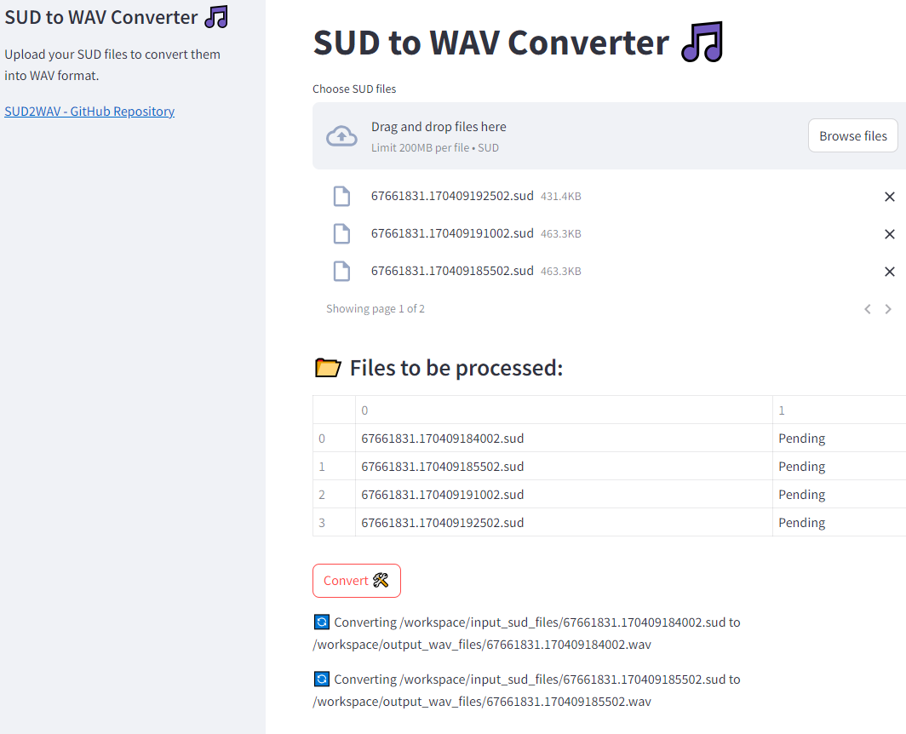
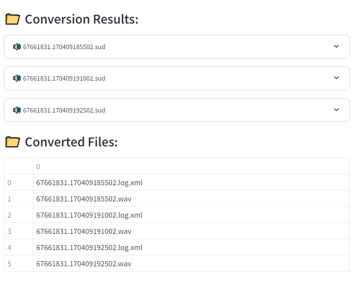
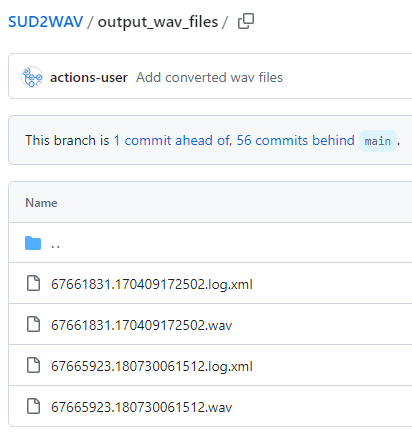
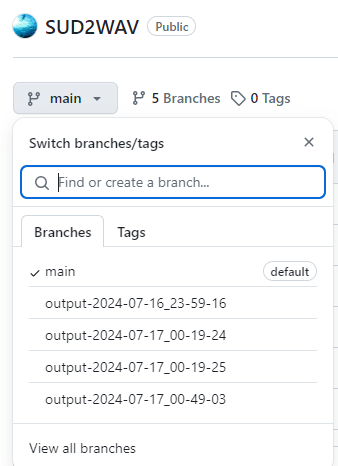

# SUD2WAV | SUD to WAV Converters
- Option 1: A Python web app to convert `.sud` files to `.wav` files using docker & Java-based conversion library
- Option 2: An automated conversion process using GitHub Action Workflow



## Table of Contents
- [Option 1. Using the Python Web App via Docker](#option-1-using-the-python-web-app-via-docker)
  - [Prerequisites](#prerequisites)
  - [Setup](#setup)
  - [Accessing the Web Application](#accessing-the-web-application)
- [Option 2. Using the GitHub Action](#option-2-using-github-action)
- [File Structure](#file-structure)
- [Disclaimer](#disclaimer)
- [License](#license)
- [Reference/Credits](#referencecredits)

## Data Files
- ‘sud’ files which are the raw downloaded file. This is a compressed file and therefore ideal for storing or sending of complete recordings.
- ‘wav’ files containing the audio. This is a Microsoft WAV format file that can be opened by any media player, matlab, etc
- ‘xml’ files contain metadata such as date recorded, gain setting, etc

## Option 1. Using the Python Web App via Docker


### Prerequisites
- Docker / Docker Compose
### Setup
1. **Clone the repository:**

    ```sh
    git clone https://github.com/MichaelAkridge-NOAA/SUD2WAV.git
    cd SUD2WAV
    ```
2. **Pull and run the Docker containers:**

    ```sh
    docker pull michaelakridge326/sud_to_wav_converter_app
    docker-compose up
    ```
    This command will build the Docker image and start the Streamlit app.
### Accessing the Web Application
1. **Access the web application:**
    Open your web browser and go to:
    ```
    http://localhost:8501
    ```
2. **Upload `.sud` files:**
    - Click on the "Browse files" button and select the `.sud` files you want to convert.
    - The selected files will be listed under "Files to be processed".
3. **Convert files:**
    - Click the "Convert" button to start the conversion process.
    - The conversion output and any errors will be displayed in the web interface.
4. **Check the output:**
    - The converted `.wav` files will be saved in the `./output_wav_files` directory on your host machine.


## Option 2. Using GitHub Action
1. Ensure your repository includes the GitHub Actions workflow file (`.github/workflows/convert.yml`):
2. Under Repo Settings > Actions > General > Workflow Permissions make sure they are set to "Read and write"
3. Add your `.sud` files to the `input_sud_files` directory and push to the repository:
    - When you push changes to the `main` branch or to the `input_sud_files` directory, the GitHub Actions workflow will be triggered to automatically convert the files.
4. View the output branch
    - The converted `.wav` files will be committed to a new branch named `output-<date_time>` in your repository.



## File Structure
```
├── docker-compose.yml
├── README.md
├── input_sud_files
│   └── (place your .sud files here)
├── output_wav_files
│   └── (converted .wav files will be saved here)
└── .github
    └── workflows
        └── convert.yml
```
----------
#### Disclaimer
This repository is a scientific product and is not official communication of the National Oceanic and Atmospheric Administration, or the United States Department of Commerce. All NOAA GitHub project content is provided on an ‘as is’ basis and the user assumes responsibility for its use. Any claims against the Department of Commerce or Department of Commerce bureaus stemming from the use of this GitHub project will be governed by all applicable Federal law. Any reference to specific commercial products, processes, or services by service mark, trademark, manufacturer, or otherwise, does not constitute or imply their endorsement, recommendation or favoring by the Department of Commerce. The Department of Commerce seal and logo, or the seal and logo of a DOC bureau, shall not be used in any manner to imply endorsement of any commercial product or activity by DOC or the United States Government.

##### License
- See the [LICENSE.md](./LICENSE.md) for details on this code
- For x3 (lossless audio compression) packing and unpacking, see their [GPL-3.0 license](https://github.com/PAMGuard/x3/blob/main/LICENSE) for more details
  
##### Reference/Credits: 
- x3 Java Source: https://github.com/PAMGuard/x3
  - Fork: https://github.com/MichaelAkridge-NOAA/x3
- https://bioacoustics.stackexchange.com/questions/1258/soundtrap-sud-extracting
